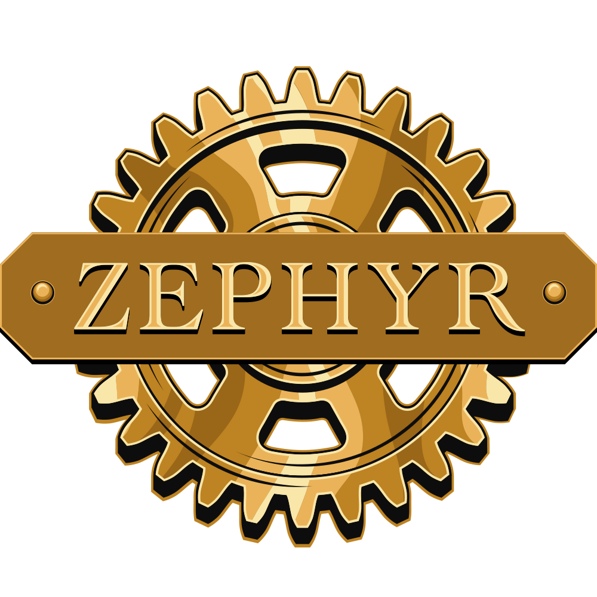

# Welcome to the Pulumi-Zephyr GitHub Organization!

This is the GitHub organization for the fictional company Zephyr Archaeotech Emporium, used in Pulumi's [series of blog posts](https://www.pulumi.com/blog/tag/zephyr) discussing infrastructure-as-code (IaC) best practices.

This GitHub organization currently hosts 6 repositories:

* `zephyr-infra`: This repository hosts a Pulumi program to stand up a base set of infrastructure on AWS.
* `zephyr-k8s`: This repository hosts a Pulumi program to declaratively manage an Elastic Kubernetes Service (EKS) cluster on AWS.
* `zephyr-data`: In this repository, you'll find a Pulumi program for managing Zephyr's Amazon Aurora database clusters.
* `zephyr-app`: This repository contains an online store application that runs on Kubernetes and leverages external databases.
* `zephyr-automation`: Pulumi Automation API programs that orchestrate operations of Pulumi stacks are found here.
* `zephyr-iac-templates`: This repository contains Pulumi IaC templates that are used with Pulumi Cloud for self-service infrastructure provisioning.
